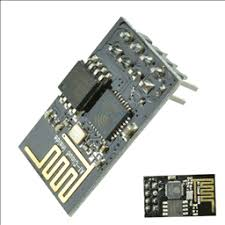

# Forklift_Arduino
Notre projet est un Chariot élévateur supportée par une grue avant, ce grue elle fonctionne pour porter et soulever des objets.
 Cette Chariot fonctionne dans toutes les directions et elle nous permet de déterminer sa trajectoire et de la contrôler grâce à une application Android.
  tout les objet et connecté avec  publish-subscribe network "**MQTT**",cette dernière et transfert les messages entre eux.
## Contents
+ [Introduction](#Forklift_Arduino)
+ [Matériel utilisé](#Matériel-utilisé)

## Matériel utilisé

