# Forklift_Arduino
Notre projet est un Chariot élévateur supportée par une grue avant, ce grue elle fonctionne pour porter et soulever des objets.
 Cette Chariot fonctionne dans toutes les directions et elle nous permet de déterminer sa trajectoire et de la contrôler grâce à une application Android.
  tout les objet et connecté avec  publish-subscribe network "**MQTT**",cette dernière et transfert les messages entre eux.
## Contents
+ [Introduction](#Forklift_Arduino)
+ [Matériel utilisé](#Matériel-utilisé)
+ [Préparez le chariot élévateur](#Préparez-le-chariot-élévateur)  
           + [fabrication de carrosserie](#Préparez-le-chariot-élévateur) 
           + [Programming esp8266](#Préparez-le-chariot-élévateur) 
           + [Circuit de projet](#Préparez-le-chariot-élévateur)
+ [Application de contrôle ( Android )](#Préparez-le-chariot-élévateur)

## Matériel utilisé
Pour ce projet, nous utilisons le drive motor l298n pour contrôler les dc gear motor,une carte arduino Uno et une carte Esp8266 pour connecter avec des autre objet . Les moteurs seront alimentés à l'aide de pile lithium 12v , la arduino sera alimentée à l'aide d’un batterie 5v . stepper motor et motor et son drive ULN2003 pour contrôle la grue . FTDI carte pour configure esp8266

<a href="https://github.com/hamzaelmoudden/Forklift_Arduino/blob/master/Assets/arduino-uno.jpg" target="_blank">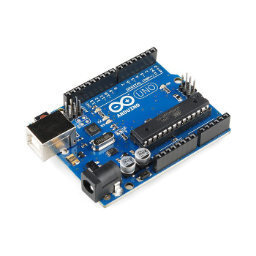</a>
<a href="https://github.com/hamzaelmoudden/Forklift_Arduino/blob/master/Assets/l298n.jpg" target="_blank">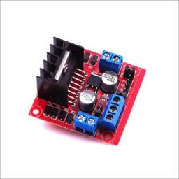</a>
<a href="https://github.com/hamzaelmoudden/Forklift_Arduino/blob/master/Assets/100uf-50v-a-800x800.jpg" target="_blank">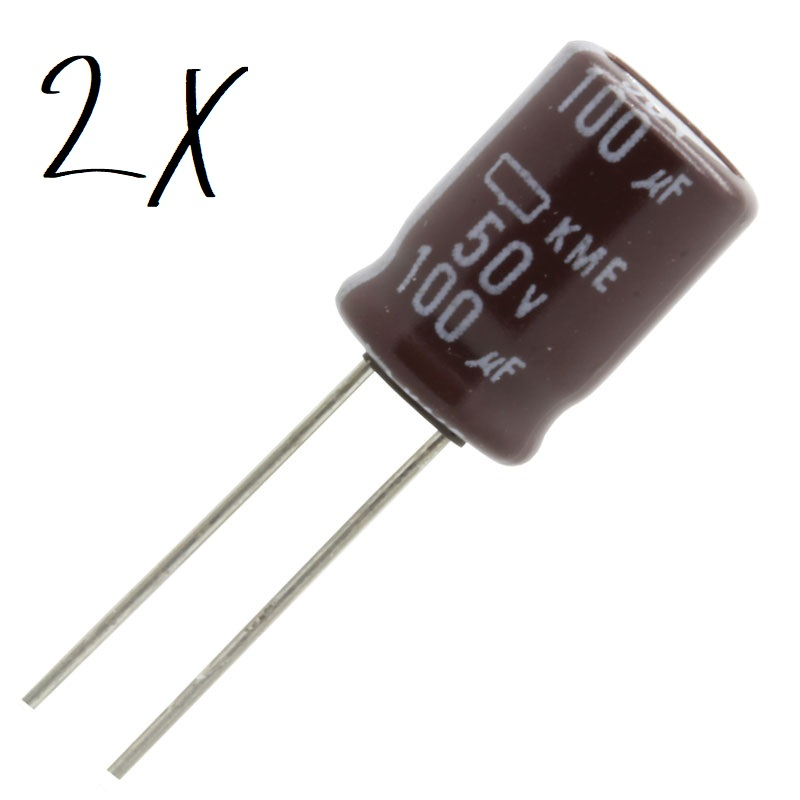</a>
<a href="https://github.com/hamzaelmoudden/Forklift_Arduino/blob/master/Assets/12vBattrery.jpg" target="_blank">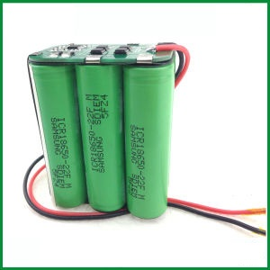</a>
<a href="https://github.com/hamzaelmoudden/Forklift_Arduino/blob/master/Assets/9V-battery.jpg" target="_blank">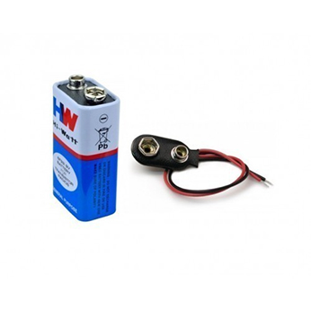</a>

<a href="https://github.com/hamzaelmoudden/Forklift_Arduino/blob/master/Assets/ULN2003-2.jpg" target="_blank">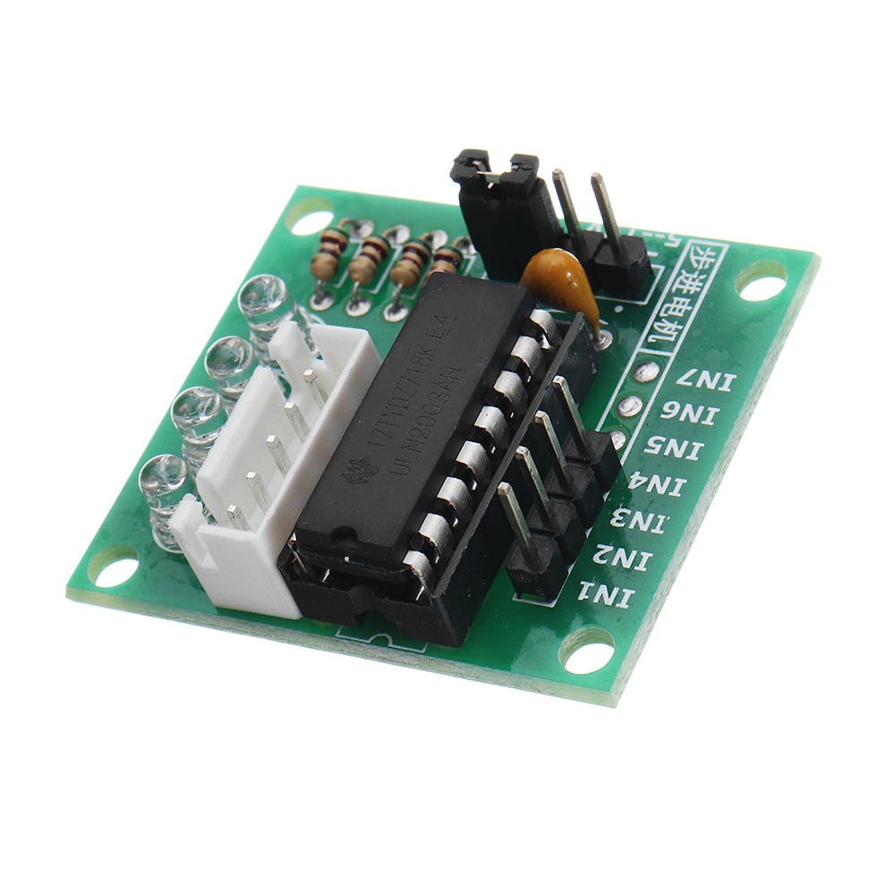</a>
<a href="https://github.com/hamzaelmoudden/Forklift_Arduino/blob/master/Assets/ftdi.jpg" target="_blank">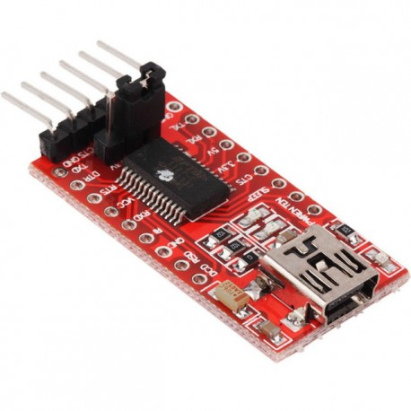</a>
<a href="https://github.com/hamzaelmoudden/Forklift_Arduino/blob/master/Assets/stepper.jpg" target="_blank">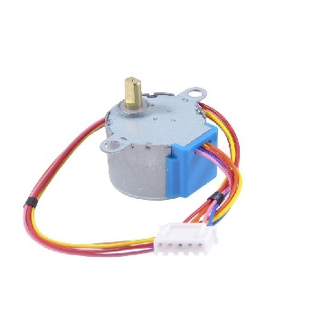</a>

## Préparez le chariot élévateur
1. La première chose est la fabrication de carrosserie :

<a href="https://github.com/hamzaelmoudden/Forklift_Arduino/blob/master/Assets/P1.jpeg" target="_blank">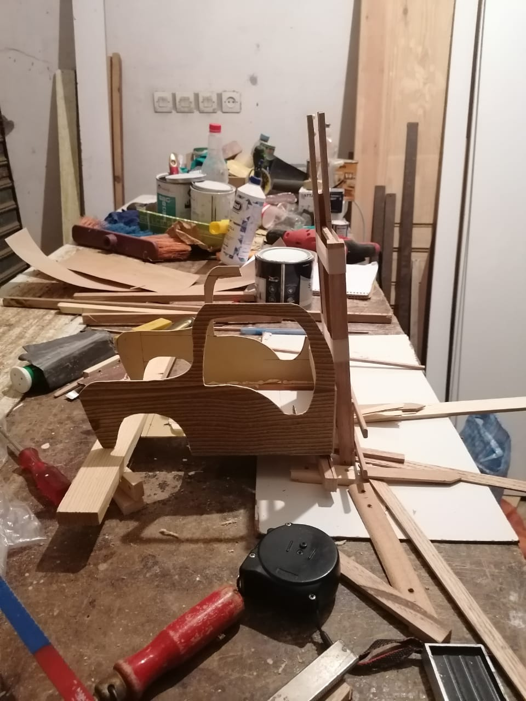</a>
<a href="https://github.com/hamzaelmoudden/Forklift_Arduino/blob/master/Assets/P2.jpeg" target="_blank">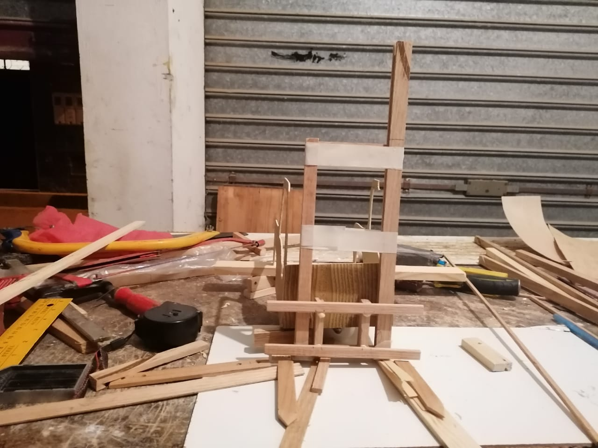</a>
<a href="https://github.com/hamzaelmoudden/Forklift_Arduino/blob/master/Assets/P3.jpeg" target="_blank">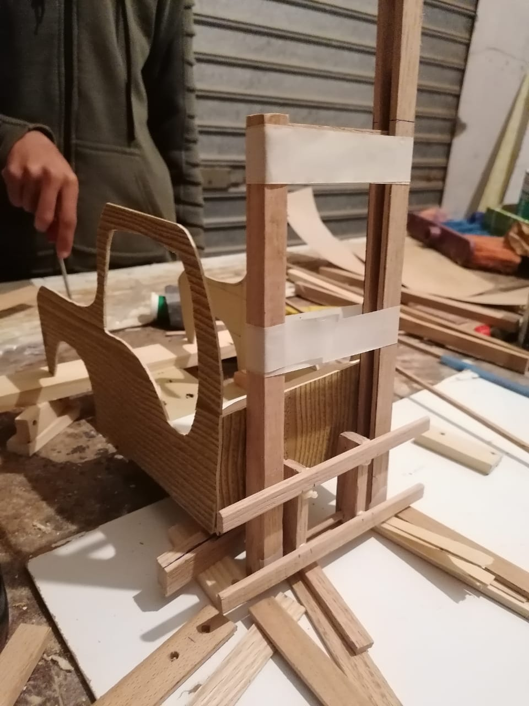</a>
<a href="https://github.com/hamzaelmoudden/Forklift_Arduino/blob/master/Assets/P4.jpeg" target="_blank">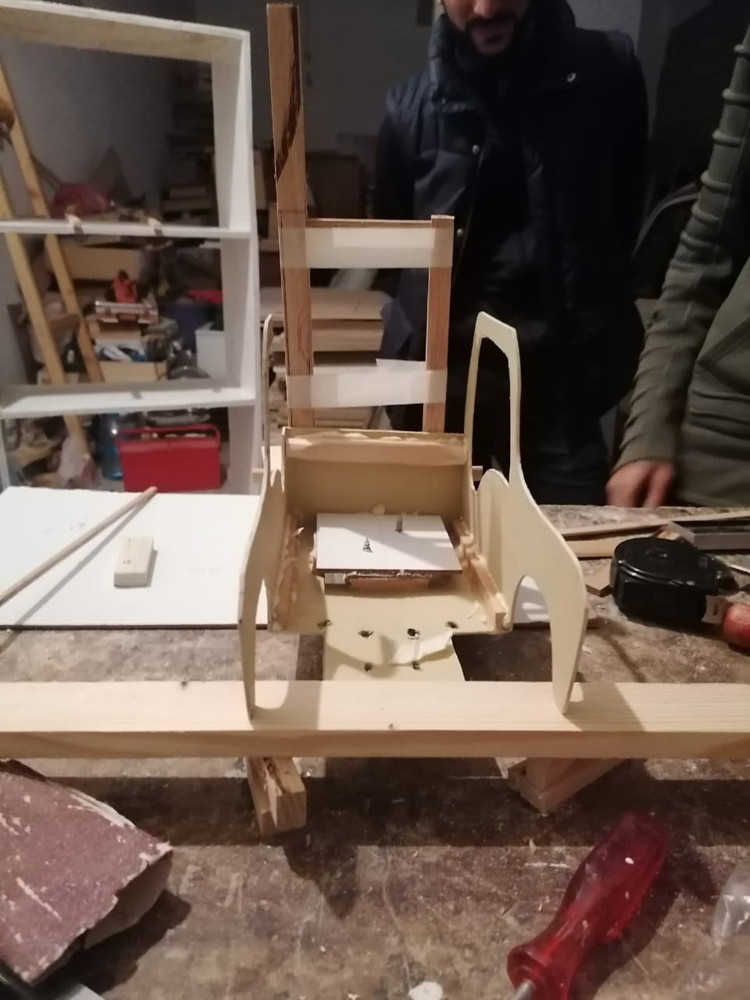</a> 

2. Programming esp8266 :

<a href="https://github.com/hamzaelmoudden/Forklift_Arduino/blob/master/Assets/prog_esp.PNG" target="_blank">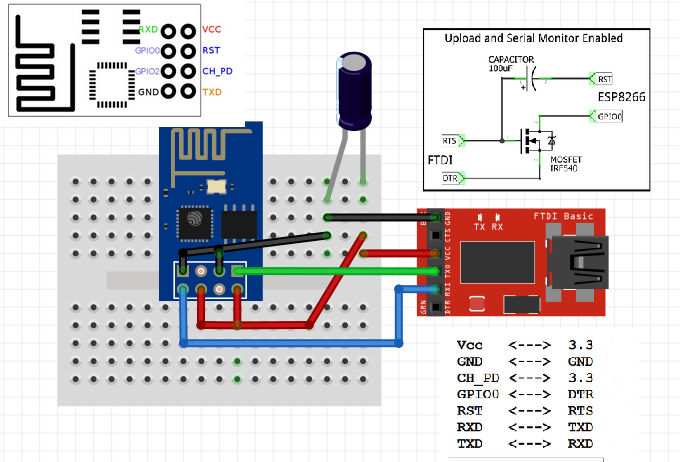</a> 
 - include les 3 librairies suivantes :
 >
 
    #include <ESP8266WiFi.h>
    #include <PubSubClient.h>
 - Les variables suivantes permettent de définir les paramètres de connexion au réseau WiFi && les paramètres de connexion a mosquitto :
 >

    #define MSG_BUFFER_SIZE  (50)
    
    const char* ssid = "LP";
    const char* password = "00000000";
    const char* mqtt_server = "test.mosquitto.org";
    
    WiFiClient espClient;
    PubSubClient client(espClient);
    unsigned long lastMsg = 0;
    
    char msg[MSG_BUFFER_SIZE];
    int value = 0;

 - Les variables suivantes permettent de définir les paramètres de connexion au réseau WiFi && les paramètres de connexion a mosquitto :
 >

    void setup_wifi() {
      delay(10);
      WiFi.mode(WIFI_STA);
      WiFi.setAutoReconnect(true);
      WiFi.begin(ssid, password);
      
      while (WiFi.status() != WL_CONNECTED) {
        delay(500);
      }
    
      randomSeed(micros());
    }
    
    void callback(char* topic, byte* payload, unsigned int length) {
      for (int i = 0; i < length; i++) {
        Serial.print((char)payload[i]);
      }
      Serial.println();
    }
    
    void reconnect() {
      while (!client.connected()) {
        String clientId = "ESP8266Client-";
        clientId += String(random(0xffff), HEX);
        // Attempt to connect
        if (client.connect(clientId.c_str())) {
          client.subscribe("lpsieForklift");
        } else {
          delay(5000);
        }
      }
    }

 - Les variables suivantes permettent de définir les paramètres de connexion au réseau WiFi && les paramètres de connexion a mosquitto :
 >

    void loop() {
    
      if (!client.connected()) {
        reconnect();
      }
      client.loop();
    
      if (Serial.available() > 0) {
        char inbyte = Serial.read();
        if(inbyte != '\n' && inbyte != '\r'){
          char msg[2];
          msg[0]=inbyte;
          msg[1]='\0';
          client.publish("lpsieForklift", msg);
        }
      }  
    }
    
   **Esp8266-code** [here](EspCode/EspCode.ino)
   
   3. Circuit de projet :
   
   <a href="https://github.com/hamzaelmoudden/Forklift_Arduino/blob/master/Assets/project.PNG" target="_blank">   
 | | Arduino pin |
|--|--|
| drive l298n | 8 - 9 - 10 - 11 - GND  |
| drive Stepper | 4 - 5 - 6 - 7 - 5v - GND  |
| Esp8266 | 3,5v - TX - RX - GND  |
 
## Application de contrôle Android :

<a href="https://github.com/hamzaelmoudden/Forklift_Arduino/blob/master/Assets/app.PNG" target="_blank">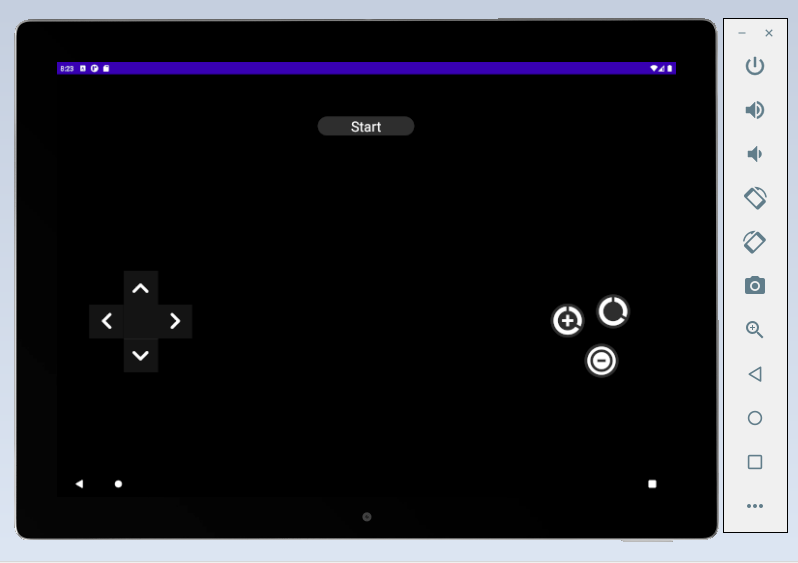
